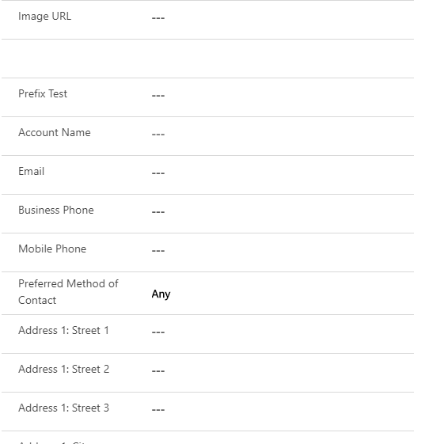

# URL Image Control

## Overview

URL Image Control allows showing the image from the URL that is stored in the single line of text type of fields.

## Download

## Configuration

| Field     | Description                       |
| --------- | --------------------------------- |
| URL Image | URL of the image you want to show |

## Preview

## Features

- Show image from URL stored in a field